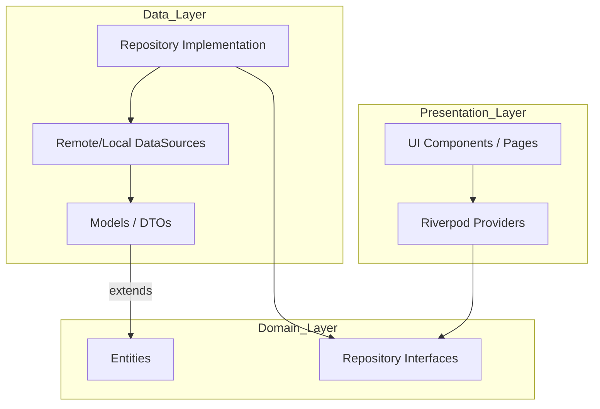
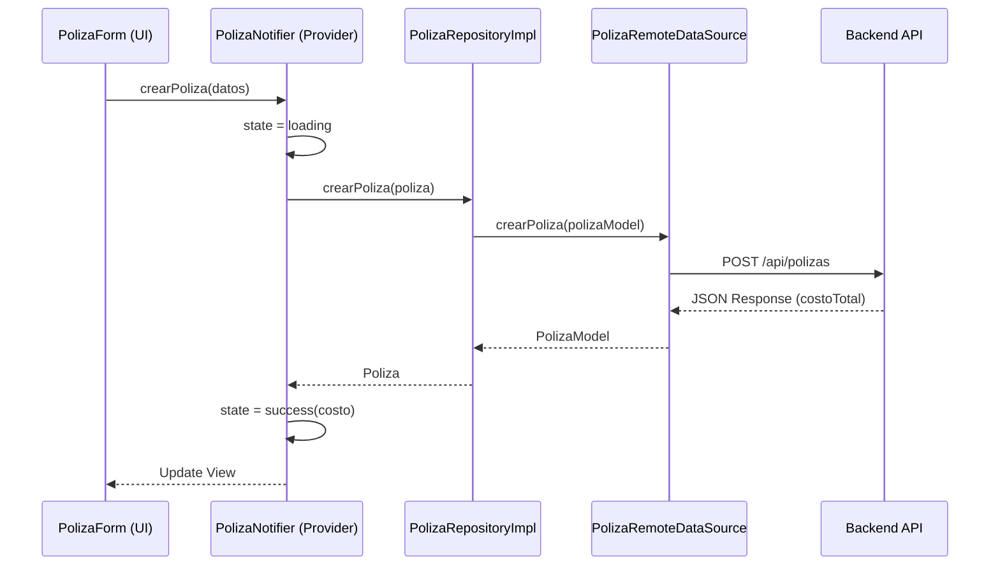

# App Native DB - Gestión de Pólizas de Seguro

Esta aplicación móvil, desarrollada en Flutter, permite gestionar y calcular el costo de pólizas de seguros de autos. Utiliza una arquitectura limpia (Clean Architecture) y Riverpod para el manejo de estados.

## 🏗️ Arquitectura de la Aplicación

La aplicación sigue los principios de **Clean Architecture**, dividiendo la lógica en capas bien definidas para asegurar la escalabilidad, mantenibilidad y facilidad de testeo.



### Descripción de las Capas:

1.  **Domain (Dominio):** Es la capa central y más estable. Contiene las entidades de negocio (`Poliza`) y las interfaces de los repositorios. No tiene dependencias externas.
2.  **Data (Datos):** Implementa las interfaces del dominio. Se encarga de la comunicación con fuentes externas (API REST en este caso), mapeo de JSON a Modelos (`PolizaModel`) y persistencia.
3.  **Presentation (Presentación):** Contiene la UI (Widgets) y la lógica de estado a través de **Riverpod**. Los `Providers` actúan como puente entre la UI y la capa de Dominio.

---

## 🔄 Flujo de Datos

El siguiente diagrama muestra cómo fluye la información cuando un usuario crea una nueva póliza:



---

## 🛠️ Tecnologías y Librerías

-   **Flutter:** Framework principal.
-   **Riverpod:** Gestión de estado reactiva y Dependency Injection.
-   **Http:** Cliente para realizar peticiones de red.
-   **Clean Architecture:** Patrón arquitectónico.

## 📁 Estructura de Carpetas

```text
lib/
 ├── core/          # Utilidades y constantes globales
 ├── data/          # Modelos, Repositorios (Impl) y DataSources
 ├── domain/        # Entidades y Contratos (Interfaces)
 ├── presentation/  # Widgets, Pages y State Management (Providers)
 └── main.dart      # Punto de entrada de la app
```

## 🚀 Instalación y Ejecución

1.  Clona el repositorio.
2.  Ejecuta `flutter pub get` para instalar dependencias.
3.  Asegúrate de tener un emulador o dispositivo conectado.
4.  Ejecuta `flutter run`.
